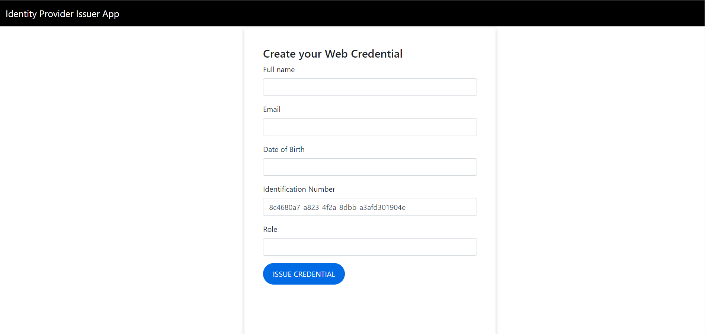
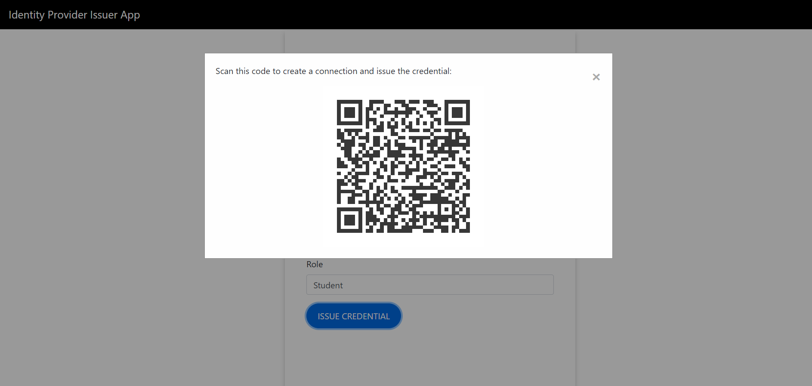

# Web Authentication Issuer App based on Trinsic API
This demo shows the use of Trinsic Credentials API calls into a nodejs app with their service client.
It also shows a webhook implementation that can create automated workflows in the app.

## Use Case
In this simple use case, the portal will act like an Identity Service Provider for web authentication which would issue credential including an email, full name, date of birth, role and an unique Identification Number.

Once a credential is issued, that holder can use these to login to various website  using the Trinsic Wallet app.

The demo of how this can be used can be found in the verification repository https://github.com/Anushka3174/SSIVerifierApp.git

## Prerequisites:
- [npm](https://www.npmjs.com/get-npm)

## Install mobile wallet

1. Download the [Android](https://play.google.com/store/apps/details?id=id.streetcred.apps.mobile) or [iOS](https://apps.apple.com/us/app/trinsic-wallet/id1475160728) Trinsic Wallet.

## Steps to issue Web credential:

### Prepare issuer portal
1. Clone the repository
`git clone https://github.com/Anushka3174/SSIIssuerApp.git`
3. Install the dependencies
`npm install`
4. Open up the repository in a code editor of your choice

### Running the application

1. Run with npm
`npm start`
2. On the web app, fill in the details and click issue credential.

4. Scan the QR with your mobile wallet.

This is a connection invitation.
Webhooks will automatically issue you a credential once this is scanned and the connection is accepted.

Then, simply accept the credential offer and receive a Web Credential!

